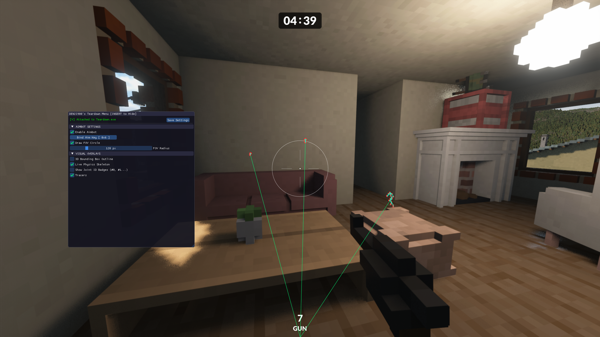

# Teardown ESP Overlay

External DirectX 11 overlay for Teardown that reads player and camera data from memory and draws ESP information.

> **Educational Use Only**
>
> This project is provided strictly for educational and research purposes. It is intended to demonstrate process memory reading, overlay rendering, and reverse engineering concepts in a controlled environment.
>
> Using this overlay may violate the game's Terms of Service and may result in account bans or other penalties. The author assumes no responsibility for any misuse.

---
This doesn't work properly in Prop Hunt yet but it's good for Deathmatch FPS game modes.

## Features

- External process attachment to `Teardown.exe`
- Automatically dumped offsets (most likely won't break every update)
- DirectX 11 transparent overlay window
- 3D bounding box ESP for players
- Tracer lines from screen bottom to players
- Live player table with:
  - Player name
  - X, Y, Z position
  - Distance from local camera
- Camera position display
- `INSERT` key to show/hide overlay menu

---

## Requirements

- Windows 10 / 11
- Visual Studio 2019 or newer
- C++17 compiler support
- DirectX 11 SDK

The project links against:

- `d3d11.lib`
- `dxgi.lib`
- `dwmapi.lib`

---

## Building from Source

Open the project and CTRL + SHIFT + B in **Release x64** mode.

---

## Usage

1. Launch Teardown.
2. Run the compiled ESP executable.
3. Press `INSERT` to show or hide the menu.
4. Use the menu to enable or disable:
   - 3D bounding box outline
   - Tracers
